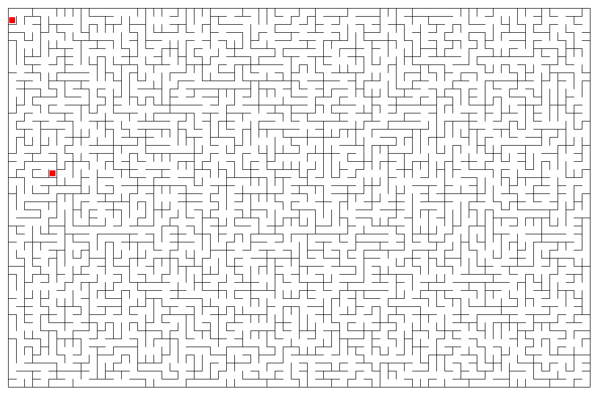

# Maze Making Program

## Introduction
I wrote this program back in university days to experiment with 
algorithms to generate a random maze as fast as asymptotically possible.
The result is a program that generates a maze as an undirected acyclic graph in 
O(n×log(log(n))) time.
Recently I decided to polish up the U/I and bring it up to snuff 
for consumption for the masses.


## Examples
<sub><sup>_A 47 row x 72 column maze made with seed 2523584398559625748_</sub></sup>


<sub><sup>_The same maze with the generated solution_</sub></sup>


## Building and Running

I decided to keep the generated code base small, so I have not used
a bunch of libraries I would normally include, for example Guava, and Apache Commons. The 
generated fat-jar is under 30k in size.

### Requires
* Java (compile: 11, run time: 11)
* Maven 3.6.1


### Building
To build the fat jar
```
mvn clean package assembly:single
```
look for `target/maze-1.0-SNAPSHOT-jar-with-dependencies.jar`

or download a java 11 compiled 
<a href="https://github.com/michapringle/maze/blob/master/maze-11.jar" download>maze-11.jar</a>. 
Look for the download button on the right.


### Running

Type `java -jar target/maze-1.0-SNAPSHOT-jar-with-dependencies.jar` on the command line, 
or double-click on the jar.
Mazes are saved in the directory the jar is run from in a directory called mazes.


### Warnings
The application allows you to specify a maximum size maze of 9,999 x 9,999, but that won't work
without a powerful machine, and increasing the heap size, for example
 `java -Xms16G -jar target/maze-1.0-SNAPSHOT-jar-with-dependencies.jar`
 My results on my 2018 MacBook Pro with 32 GB of ram, without any special jvm arguments:

| Size | Maze Generation Time | Path Generation Time | Saved File Size |
|------|----------------------|----------------------|-----------------|
| 10 x 10 | 1 ms | 2 ms | 4 kb |
| 100 x 100 | 18 ms | 30 ms | 131 kb |
| 1000 x 1000 | 1.6 s | 1.0 s | 12.8 Mb |
| 2000 x 2000 | 7.4 s | 3.9 s | 49.4 Mb |
| 3000 x 3000 | 19.7 s | 9.5 s | failed |
| 4000 x 4000 | 40.3 s | 16.9 s | failed |
| 5000 x 5000 | 70.3 s | failed | failed |

