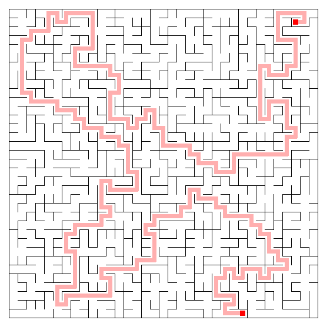
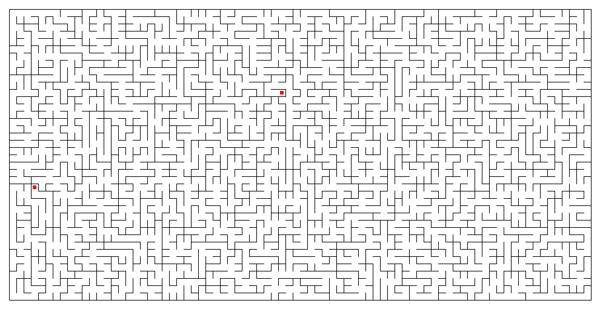
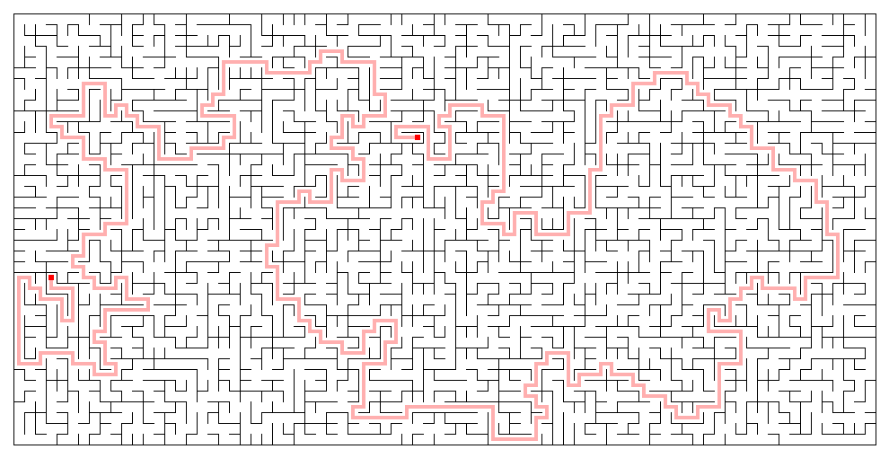

# Maze Making Program

## Introduction

I wrote this program back in university days to experiment with algorithms to generate a random maze as
fast as asymptotically possible. The result is a program that generates a maze as an undirected acyclic
graph in `O(n×log(log n))` time. In this case, n is the number of edges in the original graph, which is
exactly `2 × rows × columns - rows - columns`. Recently I decided to polish up the U/I and bring it up
to snuff for consumption for the masses.

## Examples

#### A 35 row x 35 column maze made with seed -5336817546304463102

<br clear="left"/>

#### The same maze with the generated solution

<br clear="left"/>

---

#### A 47 row x 72 column maze made with seed 2523584398559625748

<br clear="left"/>

#### The same maze with the generated solution

<br clear="left"/>

---

#### A 40 row x 80 column maze made with seed -565727417695701993

<br clear="left"/>

#### The same maze with the generated solution

<br clear="left"/>

## Building and Running

I decided to keep the generated code base small, so I have not used
a bunch of libraries I would normally include, for example Guava, and Apache Commons. The
generated fat-jar is under 30k in size.

### Requires

* Java (compile: 23, run time: 23)
* Maven 3.6.1

### Building
To build the fat jar
```
mvn clean package assembly:single
```
look for `target/maze-1.0-SNAPSHOT-jar-with-dependencies.jar`

or download a java 23 compiled 
<a href="https://github.com/michapringle/maze/blob/master/maze-23.jar" download>maze-23.jar</a>. 
Look for the download button on the right.


### Running
Type `java -jar target/maze-1.0-SNAPSHOT-jar-with-dependencies.jar` on the command line, 
or double-click on the jar. The program saves mazes to ${jar-dir}/mazes/.


### Warnings
The application allows you to specify a maximum size maze of 9,999 x 9,999, but that won't work
without a powerful machine, and increasing the heap size, for example
 `java -Xms16G -jar target/maze-1.0-SNAPSHOT-jar-with-dependencies.jar`
 My results on my 2018 MacBook Pro with 32 GB of ram, without any special jvm arguments:

| Size | Maze Generation Time | Path Generation Time | Solution Generation Time | Saved File Size |
|------|----------------------|----------------------|-----------------|-----------------|
| 10 x 10 | 1 ms | 1 ms |  0 ms | 4 kb |
| 100 x 100 | 22 ms | 12 ms | 3 ms | 131 kb |
| 1000 x 1000 | 1.5 s | 303 ms | 107 ms | 12.8 Mb |
| 2000 x 2000 | 8.5 s | 1.1 s | 467 ms | 49.4 Mb |
| 3000 x 3000 | 20.7 s | 2.9 s | 939 ms | failed |
| 4000 x 4000 | 42.5 s | 4.8 s | 1.4 s | failed |
| 5000 x 5000 | 73.2 s | 10.4 s | 2.1 s | failed |
| 6000 x 6000 | 118 s | failed | failed | failed |
